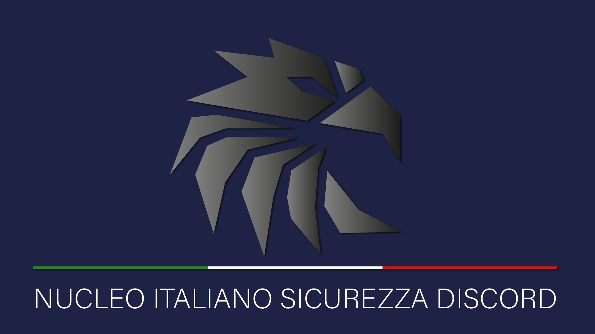

# Nucleo Italiano Sicurezza Discord

**Benvenuto/a!**

Siamo una community dedicata alla **cybersicurezza sociale**, fondata il **15 giugno 2019**, con l'obiettivo di garantire la **sicurezza e il supporto per la community italiana su Discord**. Ci teniamo a precisare che non siamo affiliati ufficialmente allo staff di Discord.

**La nostra missione principale** è creare un ambiente sicuro e informato per tutti gli utenti italiani di Discord. Promuoviamo la **consapevolezza della sicurezza online** attraverso risorse educative, supporto attivo e collaborazione tra i membri della community. Organizziamo eventi, workshop e stage pubblici per diffondere le migliori pratiche di sicurezza e aiutare gli utenti a navigare in modo sicuro sulla piattaforma.

**Coopera con tutti nel fare la differenza**. Qui, gli utenti possono fare segnalazioni pubbliche e ricevere supporto, contribuendo attivamente alla sicurezza di tutti. **Partecipa ai forum** dedicati per condividere esperienze, porre domande e collaborare per assicurare un ambiente protetto per tutti gli utenti di Discord.

**Aggiornamenti e Novità di Discord** - Manteniamo la nostra community informata su tutte le ultime novità di Discord, comprese nuove funzionalità, aggiornamenti, FAQ e sperimentazioni.

**Gestione delle segnalazioni** - Ci occupiamo di ricevere, indagare e inoltrare segnalazioni al **Team di Sicurezza di Discord**, che giungerà alle opportune conclusioni. Inoltre, il nostro team di "intelligence" è abilitato ad avviare indagini di propria iniziativa.

**Le attività del NISD** si basano sul rispetto e l'applicazione delle [__Norme della Community__](https://discord.com/guidelines), dei [__Termini di Servizio__](https://discord.com/terms) e delle [__Linee Guida per i Community Server__](https://support.discord.com/hc/it/articles/360035969312-Linee-Guida-per-i-Community-Server).
